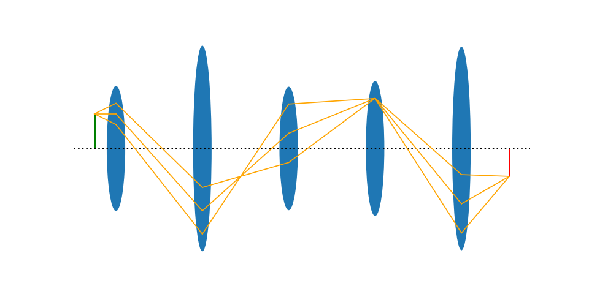

# Lens_Simulator
simulate ligth rays passing through lenses in python.
This script asks on startup the number of lenses and then opens a gui and generates an image dependening on many parameters.

</img>

dependencies:
*numpy
*matplotlib
*tkinter